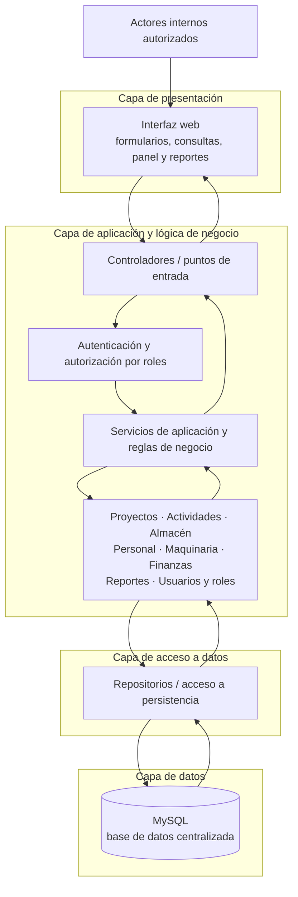

# Arquitectura inicial del sistema

## 1. Propósito

Este documento presenta una arquitectura inicial para el sistema de gestión de
una empresa constructora. La propuesta organiza las responsabilidades de la
solución y explica cómo se relacionan sus componentes. No constituye un diseño
detallado de implementación ni introduce funcionalidades fuera del alcance
documentado.

## 2. Enfoque arquitectónico

Se propone una **arquitectura web en capas** para una aplicación de gestión
centralizada. La separación en capas busca mantener diferenciadas la
interacción con los usuarios, las reglas de negocio, el acceso a la persistencia
y el almacenamiento de datos. Este enfoque es coherente con la tecnología
prevista en el caso y facilita el mantenimiento y la evolución del sistema.

La propuesta considera una aplicación central que atiende las solicitudes de
los usuarios desde un navegador y utiliza una base de datos centralizada. No se
plantea una arquitectura de microservicios ni una integración distribuida,
porque el caso no establece una necesidad que las justifique.

## 3. Capas y responsabilidades

### 3.1 Capa de presentación

Es la interfaz web utilizada por los actores internos autorizados. Presenta
formularios, consultas y vistas para:

- proyectos y actividades;
- avance de obras;
- materiales y almacén;
- personal y asignaciones;
- maquinaria y estado o asignación de equipos;
- presupuestos y gastos;
- panel principal y reportes;
- administración de usuarios y roles.

La presentación recopila las solicitudes del usuario, las envía a la capa de
aplicación y muestra el resultado. No debe contener reglas de negocio que
requieran aplicarse de manera uniforme a todas las operaciones.

### 3.2 Capa de aplicación y lógica de negocio

Coordina los casos de uso del sistema y aplica las reglas del dominio. Sus
servicios de aplicación pueden organizarse en módulos funcionales:

- **Proyectos y actividades:** administración de proyectos, registro de
  actividades y actualización del avance.
- **Materiales y almacén:** catálogo de materiales, entradas, salidas y consulta
  de existencias.
- **Personal:** registro de trabajadores y asignación a proyectos o actividades.
- **Maquinaria:** registro de equipos y control de estado y asignación.
- **Finanzas:** presupuesto y gastos asociados a los proyectos.
- **Reportes e información general:** consultas consolidadas para reportes y
  panel principal.
- **Usuarios y roles:** administración de cuentas, roles y permisos.

Los controladores o puntos de entrada reciben las solicitudes web y delegan su
procesamiento en los servicios de aplicación. Las reglas de validación se
aplican en esta capa para proteger la consistencia del sistema, sin depender de
la interfaz desde la que se origine una operación.

### 3.3 Capa de acceso a datos

Proporciona los repositorios o componentes de persistencia que permiten a los
servicios consultar y guardar información. Esta capa abstrae las operaciones de
lectura y escritura sobre proyectos, actividades, movimientos de almacén,
trabajadores, asignaciones, equipos, presupuestos, gastos, usuarios y roles.

La capa de negocio utiliza estos componentes mediante interfaces definidas; no
debería acoplarse a consultas o detalles específicos de la base de datos.

### 3.4 Capa de datos

Almacena la información central del sistema en una base de datos relacional. La
propuesta del caso identifica MySQL para esta responsabilidad. Los registros
deben permitir relacionar proyectos con sus actividades, recursos, movimientos
de materiales, asignaciones y datos financieros.

La integridad referencial y las transacciones de la base de datos respaldan las
validaciones efectuadas en la capa de negocio. La estrategia y frecuencia de
copias de seguridad deberán acordarse como parte de la operación del sistema.

## 4. Componentes y comunicación

El flujo normal de una operación es el siguiente:

1. Un usuario autorizado interactúa con la interfaz web.
2. La interfaz envía una solicitud al controlador correspondiente.
3. El controlador delega el caso de uso en un servicio de aplicación.
4. El servicio valida los datos y las reglas del proceso.
5. Cuando se requiere consultar o persistir información, el servicio utiliza
   repositorios de la capa de acceso a datos.
6. Los repositorios operan sobre la base de datos relacional.
7. El resultado vuelve por las mismas capas y se presenta al usuario.

La autenticación y la autorización por roles son preocupaciones transversales:
la identidad del usuario se verifica al acceder al sistema y los permisos deben
comprobarse para las operaciones protegidas, no solo ocultando opciones en la
interfaz. Spring Security es la tecnología prevista para implementar este
control, sujeta a confirmación de viabilidad.

## 5. Diagrama arquitectónico

## 6. Persistencia e integridad

La persistencia centralizada permitirá que los módulos consulten datos
relacionados sin mantener registros independientes por área. Las entidades de
proyecto actuarán como referencia para las actividades y los recursos asociados
cuando corresponda. Los movimientos de almacén deberán reflejarse en las
existencias; los avances, en el seguimiento del proyecto; y los gastos, en la
información financiera de la obra.

Las operaciones que modifiquen información relacionada deberán validarse y
guardarse de manera consistente para evitar registros parciales. Las reglas
específicas de cálculo de avance, stock o costos deberán precisarse durante el
diseño detallado; este documento no presupone fórmulas que el caso no define.

## 7. Relación con los drivers arquitectónicos

| Driver | Respuesta en la arquitectura |
|---|---|
| DA01. Integrar proyectos y recursos | Los módulos de negocio relacionan actividades, materiales, personal, maquinaria y finanzas con sus proyectos. |
| DA02. Proteger el acceso | El control por roles se aplica transversalmente y las operaciones protegidas verifican permisos en la capa de aplicación. |
| DA03. Preservar integridad y trazabilidad | Los servicios validan reglas de dominio y los repositorios y la base de datos mantienen relaciones consistentes. |
| DA04. Proporcionar información oportuna | Los componentes de reportes y panel consultan los módulos de origen mediante servicios y acceso a datos comunes. |
| DA05. Facilitar mantenimiento | La separación en capas y módulos delimita responsabilidades y puntos de cambio. |
| DA06. Centralizar y recuperar información | La solución utiliza una persistencia centralizada; la operación deberá establecer y probar respaldos. |
| DA07. Permitir crecimiento | Los módulos y las interfaces entre capas permiten incorporar cambios sin convertir cada ampliación en una reestructuración completa. |
| DA08. Respetar el contexto tecnológico | El enfoque web y las tecnologías Java, Spring Boot, Spring Security y MySQL son compatibles con la propuesta tecnológica del caso, pendientes de confirmación final. |

## 8. Tecnologías previstas y decisiones pendientes

La propuesta tecnológica inicial contempla:

- **Backend:** Java con Spring Boot.
- **Interfaz web:** HTML, CSS, JavaScript y Bootstrap.
- **Autenticación y autorización:** Spring Security.
- **Persistencia:** MySQL.

Estas tecnologías proceden de la propuesta del caso y deberán validarse con las
condiciones del curso, la experiencia del equipo y el entorno de despliegue.
Quedan pendientes de definición el alojamiento, la configuración de respaldos,
el dimensionamiento de infraestructura y las reglas detalladas de cálculo y
validación de cada módulo.
